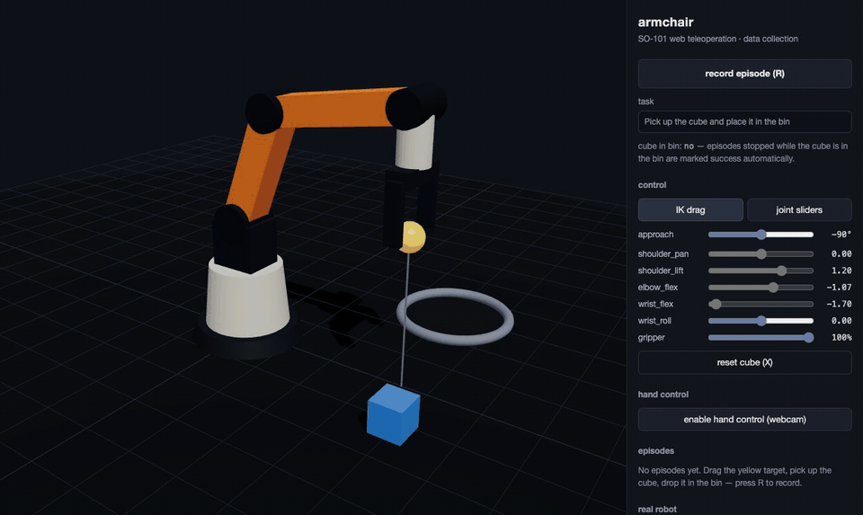
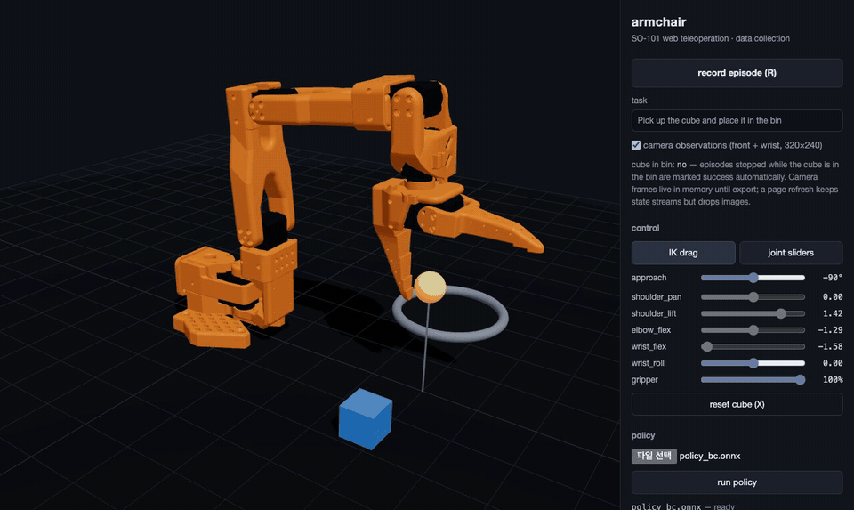

# 🛋️ armchair

**Teleoperate a robot arm and collect LeRobot-ready training data — from your browser.**



Drag a target in 3D — or wave your bare hand at your webcam — and the simulated [SO-101](https://github.com/TheRobotStudio/SO-ARM100) (official URDF, rigid-body physics) follows via analytic IK. Press `R`, do the task, press `R` again — that's one imitation-learning episode with state **and camera** observations. Export it as a [LeRobot](https://github.com/huggingface/lerobot)-compatible dataset, train ACT on it, export to ONNX, and **watch your own policy drive the arm back in the browser**. Or stream the same joint targets to a real $100 SO-101 over WebSocket.

No ROS. No VR headset. No robot required to start.

## Quickstart

```bash
cd web
npm install
npm run dev        # open http://localhost:5173
```

That's it. You are teleoperating a robot arm.

## What it does

- **The real SO-101** — the official URDF + STL meshes from TheRobotStudio, joint limits and kinematics calibrated against the model (grasp-point IK exact to <2 mm across the workspace).
- **Rigid-body physics** — Rapier (WASM): the cube falls, slides, gets nudged by the gripper, and lands in the bin for real. Grasping stays kinematic on purpose, so demonstrations are clean.
- **Browser teleoperation** — drag the yellow target, the arm follows (analytic elbow-up IK with automatic approach-angle relaxation at joint limits, servo-speed-limited like real Feetech servos). Or per-joint sliders.
- **Hand-tracking teleoperation** — drive the arm with your bare hand via webcam (MediaPipe, fully in-browser): move to steer, closer/farther for reach, fist to grab, open hand to release.
- **Episode recording at 30 Hz** — `observation.state`, `action`, `observation.environment_state` (cube pose), **plus two camera streams** (fixed front + wrist cam, 320×240 JPEG) rendered offscreen with the teleop overlays stripped out — the same feature layout LeRobot trains on.
- **Replay** — play any recorded episode back in the sim before you spend GPU hours on it.
- **LeRobot export** — one click downloads a ZIP; one command converts it to a real `LeRobotDataset` (parquet + encoded videos) ready for `lerobot` training or the Hugging Face Hub.
- **In-browser policy playback** — load an ONNX-exported ACT policy and it drives the arm at 30 Hz via onnxruntime-web. The full collect → train → deploy loop without leaving your desk: [docs/TRAINING.md](docs/TRAINING.md).
- **Real-robot bridge** — the same 30 Hz action stream drives a physical SO-101 through `scripts/so101_bridge.py`.

## Controls

| input | action |
| --- | --- |
| drag yellow target | move end-effector (XZ plane) |
| `Shift` + drag | move end-effector vertically |
| `Space` | open / close gripper |
| `Q` / `E` | wrist roll |
| `R` | start / stop recording |
| `X` | reset the cube |
| approach slider | end-effector approach angle (default: straight down) |
| hand control | webcam: hand position steers the arm, hand distance = reach, fist = grab, open hand = release |

Hand-tracking mapping constants (axis signs, ranges, pinch thresholds) live at the top of [`web/src/lib/hand.ts`](web/src/lib/hand.ts) — tune them to taste.

## Teach it, then let it drive



That's not teleoperation — that's a learned policy (`examples/policy_bc.onnx`, 1.2 MB) picking cubes on its own, running entirely in the browser via onnxruntime-web. In our evaluation it cleared **16/16 random cube placements, median 0.9 s per pick** — faster than the demonstrations it was trained on, because it commits to lookahead waypoints instead of imitating the human's pauses.

Train your own in minutes, no GPU and no lerobot needed:

```bash
pip install numpy onnx
python scripts/train_bc.py your_exported_dataset.zip --out my_policy.onnx
```

`train_bc.py` is a ~200-line behavior-cloning MLP (stacked observations, action-chunk prediction, noise-injected robustness — the same ideas ACT uses, minus the transformer). Load the `.onnx` in the app's **policy** section and press run. For the full ACT pipeline see [docs/TRAINING.md](docs/TRAINING.md).

## From browser to LeRobot dataset

```bash
# 1. record episodes in the browser, click "export dataset (.zip)"
# 2. convert:
pip install lerobot pillow
python scripts/convert_to_lerobot.py armchair_dataset_2026-07-04.zip \
    --repo-id yourname/armchair-so101-pick --skip-failed --push
# 3. train any lerobot policy (ACT, diffusion, ...) on it — see docs/TRAINING.md
```

The exported features:

| feature | shape | contents |
| --- | --- | --- |
| `observation.state` | (6,) | joint positions, radians (gripper 0–1) |
| `action` | (6,) | commanded joint targets |
| `observation.environment_state` | (3,) | cube xyz — free ground truth from the sim |
| `observation.images.front` | (240,320,3) | fixed scene camera |
| `observation.images.wrist` | (240,320,3) | gripper-mounted camera |

## Driving a real SO-101

```bash
pip install lerobot websockets
python scripts/so101_bridge.py --dry-run                    # check values first!
python scripts/so101_bridge.py --port /dev/tty.usbmodem1    # then the real thing
```

Press **connect** in the web app (`ws://localhost:8765`) and the arm mirrors your browser teleoperation live. Calibrate the follower with lerobot first, and always start with `--dry-run` — sign/offset mapping lives at the top of the bridge script.

## Why

LeRobot made *training* robot policies accessible. *Collecting demonstrations* is still the annoying part — leader arms, VR rigs, ROS setups. A browser is the lowest-friction teleoperation device that exists, and for low-DOF arms like the SO-101 it is plenty. Armchair is the shortest path from "I'm curious about robot learning" to "I have a dataset."

## Roadmap

Sim-first, hardware later — see [docs/ROADMAP.md](docs/ROADMAP.md).

- [x] browser sim + IK teleoperation + 30 Hz episode recording
- [x] webcam hand-tracking teleoperation (MediaPipe, in-browser)
- [x] LeRobot dataset export / conversion
- [x] WebSocket bridge to a real SO-101
- [x] official SO-101 URDF model + calibrated kinematics
- [x] rigid-body physics (Rapier WASM)
- [x] camera observations (offscreen render → dataset video streams)
- [x] in-browser policy playback (onnxruntime-web) + ACT training guide
- [x] built-in CPU trainer (`scripts/train_bc.py`) + shipped sample policy (16/16 eval)
- [ ] multi-cube / randomized task variants
- [ ] policy rollout success-rate benchmark in the sim
- [ ] leader-arm and gamepad input

## License

MIT

---

### 한국어 요약

브라우저에서 SO-101 로봇팔을 드래그로 조종해 모방학습 데이터를 수집하는 오픈소스 툴킷입니다. ROS·VR 장비 없이 `npm run dev` 한 줄로 시작하고, 수집한 에피소드는 LeRobot 호환 데이터셋으로 변환해 바로 학습에 쓰거나, WebSocket 브릿지로 실물 SO-101을 그대로 조종할 수 있습니다. 상세 로드맵은 [docs/ROADMAP.md](docs/ROADMAP.md) 참고.
